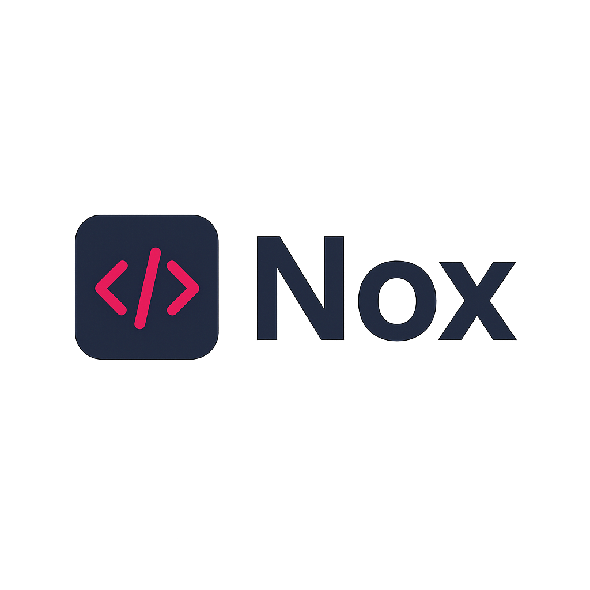

<p align="center">
  
</p>

<h1 align="center">Nox Programming Language</h1>

<h1 align="center">Nox Programming Language</h1>

# 🌌 Nox Language

**Nox** is a minimal scripting language inspired by Lox with support for variables, functions, recursion, loops, arithmetic expressions, and closures. It is designed for algorithmic expression and educational compiler development.

---

## 📜 Table of Contents

- [Syntax Overview](#syntax-overview)
- [Variables](#variables)
- [Functions](#functions)
- [Control Flow](#control-flow)
  - [If Condition](#if-condition)
  - [Loops](#loops)
- [Recursion Examples](#recursion-examples)
- [Scoping & Closures](#scoping--closures)
- [Sample Programs](#sample-programs)
- [Running Nox Code](#running-nox-code)
- [License](#license)

---

## 📌 Syntax Overview

### Variables

```kotlin
var name = "value";
var number = 123;
```

---

### Functions

```kotlin
fun functionName(arg1, arg2) {
  // statements
  return value;
}
```

---

### Printing

```kotlin
print(expression);
```

---

### Operators

Arithmetic: `+`, `-`, `*`, `/`, `%`  
Comparison: `==`, `!=`, `<`, `>`, `<=`, `>=`  
Builtin: `floor(x)` returns the largest integer ≤ x

---

## 🔁 Control Flow

### If Condition

```kotlin
if (condition) {
  // true block
} else {
  // false block
}
```

---

### Loops

```kotlin
for (var i = 0; i < 5; i = i + 1) {
  print(i);
}
```

---

## 🧠 Recursion Examples

### Sum of Digits

```kotlin
fun sumDigits(a) {
  if (floor(a) == 0.0) {
    return 0;
  }
  return (a % 10) + sumDigits(a / 10);
}
print(floor(sumDigits(1234))); // Output: 10
```

---

### Reverse Digits

```kotlin
fun reverse(a, res) {
  if (floor(a) == 0.0) {
    return res;
  }
  return reverse(floor(a / 10), floor(res * 10 + (a % 10)));
}
print(floor(reverse(1234, 0))); // Output: 4321
```

---

### Binary Conversion

```kotlin
fun toBinary(n) {
  if (floor(n) == 0.0) {
    return;
  }
  toBinary(n / 2);
  print(floor(n % 2));
}
toBinary(10); // Output: 1010
```

---

## 📚 Scoping & Closures

```kotlin
var a = "global";
{
  fun showA() {
    print(a);
  }

  showA();         // prints "global"
  var a = "block";
  showA();         // prints "nil" due to shadowing
}
```

---

## 🧪 Sample Programs

### Factorial Using For Loop

```kotlin
fun fact(n) {
  var result = 1;
  for (var i = 2; i <= n; i = i + 1) {
    result = result * i;
  }
  return result;
}
print(fact(5)); // Output: 120
```

---

### Loop Inside Recursion

```kotlin
fun printNested(n) {
  if (n == 0) {
    return;
  }

  for (var i = 0; i < n; i = i + 1) {
    print("n = " + n + ", i = " + i);
  }

  printNested(n - 1);
}
printNested(3);
```

Expected Output:

```
n = 3, i = 0
n = 3, i = 1
n = 3, i = 2
n = 2, i = 0
n = 2, i = 1
n = 1, i = 0
```

---

### Fibonacci Series

```kotlin
fun fib(n) {
  if (n <= 1) {
    return n;
  }
  return fib(n - 1) + fib(n - 2);
}
for (var i = 0; i < 6; i = i + 1) {
  print(fib(i));
}
```

Output:

```
0
1
1
2
3
5
```

---

## 🚀 Running Nox Code

To run a `.nox` file:

```bash
./target/debug/lox_lang path/to/file.nox
```

Example:

```bash
./target/debug/lox_lang test.nox
```

---

## 📖 License

This language is built for educational and experimental use.  
Inspired by [Crafting Interpreters](https://craftinginterpreters.com/) by Robert Nystrom.

---

> Made with ❤️ in Rust — for recursion, reasoning, and runtime magic.
